# ✈️ Voya9e
Voya9e는 다양한 기능을 활용한 안정적이고 효율적인 여행 일정 관리 사이트입니다.<br><br><br><br>


<br>

## 프로젝트 소개

- 지도 검색, 날씨 검색 등을 통한 효율적인 여행 계획 수립
- 그룹화와 WebSocket을 활용한 팀 작업으로 안정적인 다중 일정 관리
- 영수증 OCR을 통한 정산 및 여행 경비 관리
- 챗봇을 활용한 여행지 추천, 일정 정리

<br>

## 팀원 구성

<div align="center">

| **윤건우** | **김가현** | **이현섭** | **정지수** | **장준우** |
| :------: |  :------: | :------: | :------: | :------: |
| [ <br/> @oo-ni](https://github.com/oo-ni) | [ <br/> @kahyun0255](https://github.com/kahyun0255) | [ <br/> @LeeHyeonseob](https://github.com/LeeHyeonseob) | [ <br/> @wjdwltn](https://github.com/wjdwltn) | [ <br/> @highjjjw](https://github.com/highjjjw)

</div>

<br>

## 개발 기간
2024.09.23 ~ 2024.10.10

<br>

## 팀 페이지 및 기획서
- <a href="https://www.notion.so/9-ef1c5042e8514c2eaad4f4b925f60e82?pvs=4">Notion Team Page</a>

- <a href="https://www.notion.so/9-2-34f399b1a3ef41ffa2558a9949ec9bf6?pvs=4">9팀 2차 프로젝트 기획서</a>

<br>

## 1. 개발 환경

- **OS** : Windows / MacOS
- **IDE** : IntelliJ IDEA 2024.1.4 (Ultimate Edition)
- **Language** : Java
- **Runtime Version** : 17.0.11+1-b1207.24 aarch64
- **Build Tool** : Gradle
- **Backend** : SpringBoot, JPA, QueryDSL
- **DB** : MySQL (Amazon RDS), Redis
- **Frontend** : React
- **ETC** : StompJS, JWT, Swagger UI, JUnit
<br>

## 2. 코드 컨벤션과 브랜치 전략
### 코드 컨벤션
<details>
<summary>Code Convention</summary>

<br>

> ☝ **명확한 의미 전달을 위해 축약형 사용을 지양합니다.**

> ☝ **작성한 코드를 팀원도 이해할 수 있도록 주석을 달아줍니다.** → 선택
> 
> ```java
> /**
>  * 사용자 관리를 위한 UserService 클래스
>  */
> public class UserService {
> 
>     /**
>      * 사용자를 등록하는 메서드
>      * @param user 등록할 사용자 객체
>      * @return 등록된 사용자 객체
>      */
>     public User registerUser(User user) {
>         // ...
>     }
> }
> ```

<br>

> ☝ **패키지 이름은 소문자로 생성하고, 역할이나 기능에 따라 명확하게 묶어서 명명합니다.**
> 
> 언더스코어 ‘_’나 대문자를 섞지 않습니다.
> 
> ```java
> com.example.project.controller
> com.example.project.service
> com.example.project.repository
> com.example.project.model
> ```

<br>

> ☝ **상수는 대문자와 언더스코어(”_“)로, 변수와 메서드는 CamelCase 형식으로 작성합니다.**
> 
> ```java
> // 상수
> static final int MAX_COUNT = 100;
> 
> // 변수
> int itemCount;
> 
> // 메서드
> public String printCount() { ... }
> ```

<br>

> ☝ **변수명을 짓기 어려울 때에는 아래 사이트의 도움을 받아봅시다!**
> 영어로 선택 후 원하는 단어를 검색하면 됩니다.
> 
> [Curioustore](https://curioustore.com/#!/)

<br>

> ☝ **Boolean 타입의 변수는 접두사로 is를 사용해 변수명을 작성합니다.**
> 
> ```java
> boolean isExist;
> boolean isTrue;
> ```

<br>

> ☝ **long 타입의 값의 마지막에는 대문자 ‘L’을 붙여줍시다.**
> 
> ```java
> long base = 54423234211L;
> ```

<br>

> ☝ **컬렉션 이름은 복수형을 사용하거나 컬렉션임을 명시해줍니다.**
> 
> ```java
> List ids;
> Map<User, int> userMap;
> ```

<br>

> ☝ **클래스명은 명사로 작성하고 UpperCamelCase를 사용합니다.**
> 
> ```java
> private class Address { ... }
> public class UserEmail { ... }
> ```

<br>

> ☝ **메서드명은 소문자로 시작하고 동사로 네이밍합니다.**
> 
> 대표적인 메서드들의 네이밍 규칙은 아래를 따릅니다.
> 
> ```java
> // 조회(상세)
> getXXX()
> getXXXDetail()
> getXXXInfo()
> 
> // 조회(리스트)
> getXXXList()
> 
> // 조회(카운트)
> getXXXCount()
> 
> // 등록
> createXXX()
> addXXX()
> registXXX()
> 
> // 수정
> updateXXX()
> modifyXXX()
> 
> // 삭제
> removeXXX()
> deleteXXX()
> ```

<br>

> ☝ **Enum 변수의 이름은 대문자로 작성합니다.**
> 
> ```java
> // 상태 - XXX_STATUS
> public enum MemberStatus {
>     WAITING_STATUS,    // 수락 대기 상태
>     ACCEPT_STATUS,     // 수락 상태
>     WITHDRAW_STATUS    // 탈퇴 상태
> }
> 
> // 유형 - XXX_TYPE
> public enum UserType {
>     ADMIN_TYPE,
>     CUSTOMER_TYPE,
>     GUEST_TYPE;
> }
> ```

<br>

> ☝ **builder를 호출하는 static 메서드는 다음 규칙을 따릅니다.**
> 
> 1. 파라미터가 1개인 경우: **xxxFrom**
> 
> ```java
> public static User createUserFromUsername(String username) {
>     // username을 사용해 builder 호출
>     return new User(username);
> }
> ```
> 
> 2. 파라미터가 2개 이상인 경우: **xxxOf**
> 
> ```java
> public static User createUserOf(String username, String email) {
>     // username과 email을 사용해 builder 호출
>     return new User(username, email);
> }
> ```

<br>

> ☝ **다른 객체로 변환하는 메서드의 이름은 toEntity 형식으로 선언합니다.**
> 
> ```java
> @Getter
> public class ProductCreateRequest {
>     private ProductType type;
>     private ProductSellingStatus sellingStatus;
>     private String name;
>     private int price;
> 
> 		// AllArgumentConstructor는 private으로 직접 사용을 막아주고, 
> 		// @Builder 선언해서 직접 사용 막기
>     @Builder
>     private ProductCreateRequest(ProductType type, ProductSellingStatus sellingStatus, String name, int price) {
>         this.type = type;
>         this.sellingStatus = sellingStatus;
>         this.name = name;
>         this.price = price;
>     }
> 
> 		// toEntity
>     public Product toEntity(String productNumber) {
>         return Product.builder()
>                 .productNumber(productNumber)
>                 .type(type)
>                 .sellingStatus(sellingStatus)
>                 .name(name)
>                 .price(price)
>                 .build();
>     }
> }
> ```

<br>

> ☝ **Dto에서 배열 1개만 리턴할때는 Dto에 담지 않고 배열 자체를 반환해주도록 합시다.**
> 
> ```java
> {
>   list : [
>     "안녕하세요",
>     "~입니다."
>   ]
> }
> ```
> 
> 프론트에서 list에 한번 더 접근해야 하기 때문에 번거로워질 수 있습니다.
> 
> 따라서 아래처럼 Dto가 아닌 배열 자체를 반환해주도록 합니다.
> 
> ```java
> [
>   "안녕하세요",
>   "~입니다."
> ]
> ```

</details>


### 브랜치 전략

- Git-flow 전략을 기반으로 main, develop 브랜치와 feature 보조 브랜치를 운용했습니다.
- main, develop, Feat 브랜치로 나누어 개발을 하였습니다.
    - **main** 브랜치는 배포 단계에서만 사용하는 브랜치입니다.
    - **develop** 브랜치는 개발 단계에서 git-flow의 master 역할을 하는 브랜치입니다.
    - **Feature** 브랜치는 기능 단위로 독립적인 개발 환경을 위하여 사용하고 merge 후 각 브랜치를 삭제해주었습니다.

<br>

## 3. 프로젝트 구조

<details>
<summary>Backend 코드 구조</summary>
  
  ```
  src
  └── main
      └── java
          └── com.grepp.nbe1_2_team09
              ├── admin
              │   ├── config
              │   │   ├── RedisConfig.java
              │   │   └── SecurityConfig.java
              │   ├── dto
              │   │   └── CustomUserInfoDTO.java
              │   ├── jwt
              │   │   ├── CookieUtil.java
              │   │   ├── JwtFilter.java
              │   │   └── JwtUtil.java
              │   ├── redis
              │   │   ├── entity
              │   │   └── repository
              │   └── service
              │       ├── oauth2
              │       ├── CustomUserDetails.java
              │       └── CustomUserDetailsService.java
              │
              ├── common
              │   ├── config
              │   │   ├── OpenAiConfig.java
              │   │   ├── RestTemplateConfig.java
              │   │   ├── SwaggerConfig.java
              │   │   └── WebSocketConfig.java
              │   ├── exception
              │   │   ├── BaseException.java
              │   │   ├── ErrorResponse.java
              │   │   ├── ExceptionMessage.java
              │   │   └── GlobalExceptionHandler.java
              │   └── util
              │       ├── aop
              │       │   ├── LogAspect.java
              │       │   └── LogExecutionTime.java
              │       └── TranslationUtil.java
              │
              ├── controller
              │   ├── chatBot
              │   │   ├── ChatBotController.java
              │   │   └── dto
              │   ├── city
              │   │   ├── CityApiController.java
              │   │   └── dto
              │   ├── event
              │   │   ├── EventController.java
              │   │   ├── EventLocationController.java
              │   │   └── dto
              │   ├── finance
              │   │   ├── AccountBookController.java
              │   │   ├── ExchangeRateController.java
              │   │   └── dto
              │   ├── group
              │   │   ├── GroupController.java
              │   │   └── dto
              │   ├── location
              │   │   ├── LocationApiController.java
              │   │   └── LocationController.java
              │   ├── user
              │   │   ├── UserController.java
              │   │   └── dto
              │   └── weather
              │       ├── WeatherController.java
              │       └── dto
              │   
              ├── domain
              │   ├── entity
              │   │   ├── event
              │   │   │   ├── Event.java
              │   │   │   ├── EventLocation.java
              │   │   │   └── EventStatus.java
              │   │   ├── group
              │   │   │   ├── invitation
              │   │   │   │   ├── GroupInvitation.java
              │   │   │   │   └── InvitationStatus.java
              │   │   │   ├── Group.java
              │   │   │   ├── GroupMembership.java
              │   │   │   ├── GroupRole.java
              │   │   │   └── GroupStatus.java
              │   │   ├── user
              │   │   │   ├── OAuthProvider.java
              │   │   │   ├── Role.java
              │   │   │   └── User.java
              │   │   ├── ExchangeRate.java
              │   │   ├── Expense.java
              │   │   ├── Location.java
              │   │   ├── LocationType.java
              │   │   ├── Route.java
              │   │   └── Task.java
              │   │
              │   ├── repository
              │   │   ├── event
              │   │   │   ├── eventrepo
              │   │   │   │   ├── EventRepository.java
              │   │   │   │   ├── EventRepositoryCustom.java
              │   │   │   │   └── EventRepositoryImpl.java
              │   │   │   └── EventLocationRepository.java
              │   │   ├── finance
              │   │   │   ├── AccountBookRepository.java
              │   │   │   └── ExchangeRateRepository.java
              │   │   ├── group
              │   │   │   ├── membership
              │   │   │   │   ├── GroupMembershipRepository.java
              │   │   │   │   ├── GroupMembershipRepositoryCustom.java
              │   │   │   │   └── GroupMembershipRepositoryImpl.java
              │   │   │   ├── GroupInvitationRepository.java
              │   │   │   └── GroupRepository.java
              │   │   ├── location
              │   │   │   └── LocationRepository.java
              │   │   └── user
              │   │       └── UserRepository.java
              │   │
              │   └── service
              │       ├── chatBot
              │       │   └── ChatBotService.java
              │       ├── city
              │       │   └── CityApiService.java
              │       ├── event
              │       │   ├── EventLocation.java
              │       │   └── EventService.java
              │       ├── finance
              │       │   ├── AccountBookService.java
              │       │   ├── ExchangeRateService.java
              │       │   └── OCRService.java
              │       ├── group
              │       │   └── GroupService.java
              │       ├── location
              │       │   ├── LocationApiService.java
              │       │   └── LocationService.java
              │       ├── user
              │       │   └── UserService.java
              │       └── weather
              │           └── WeatherService.java
              │
              ├── notification
              │   ├── controller
              │   │   ├── NotificationController.java
              │   │   └── dto
              │   ├── entity
              │   │   └── Notification.java
              │   ├── repopsitory
              │   │   └── NotificationRepository.java
              │   └── service
              │       └── NotificationService.java
              │
              ├── schedule.controller
              │   ├── dto
              │   └── ScheduleController.java
              │
              └── Nbe12Team09Application.java
  └── test
      └── java
          └── com.grepp.nbe1_2_team09
              ├── domain.service
              │   ├── EventServiceTest.java
              │   ├── AccountBookServiceTest.java
              │   ├── OCRServiceTest.java
              │   ├── GroupServiceTest.java
              │   └── LocationServiceTest.java
              └── Nbe12Team09ApplicationTests.java
  ```
</details>
<details>
<summary>Frontend 코드 구조</summary>
  
  ```
  voya9e/
    ├── build/
    ├── node_modules/
    ├── public/
    ├── src/
    │   ├── components/
    │   │   ├── NavBar.js
    │   │   └── WeatherSearch.js
    │   ├── context/
    │   │   └── NotificationContext.js
    │   ├── pages/
    │   │   ├── accountBook/
    │   │   ├── chatBot/
    │   │   ├── Event/
    │   │   ├── Schedule/
    │   │   ├── ChangePasswordPage.js
    │   │   ├── CreateGroup.js
    │   │   ├── DeleteAccountPage.js
    │   │   ├── Group.css
    │   │   ├── GroupList.js
    │   │   ├── GroupMembers.js
    │   │   ├── InviteMember.js
    │   │   ├── LoginPage.js
    │   │   ├── MainPage.js
    │   │   ├── MyPage.js
    │   │   ├── Notification.js
    │   │   ├── SignupPage.js
    │   │   ├── UpdateProfilePage.js
    │   │   └── user.css
    │   ├── services/
    │   │   └── api.js
    │   ├── styles/
    │   │   └── GlobalStyles.js
    │   ├── utils/
    │   ├── App.css
    │   ├── App.js
    │   ├── App.test.js
    │   ├── index.css
    │   ├── index.js
    │   ├── logo.svg
    │   ├── reportWebVitals.js
    │   ├── setupTests.js
    │   └── voya9eLogo.png
    ├── .gitignore
    ├── package-lock.json
    ├── package.json
    └── README.md
  ```
</details>

<br>

### Sequence Diagram
<details>
<summary>Sequence Diagram</summary>
  
# 1. 회원

### 1.1. 회원가입

사용자는 이메일, 비밀번호, 사용자 정보를 입력하여 회원가입을 요청한다. 서버는 중복된 이메일이 있는지 확인 후, 중복이 없으면 사용자 정보를 저장한다.

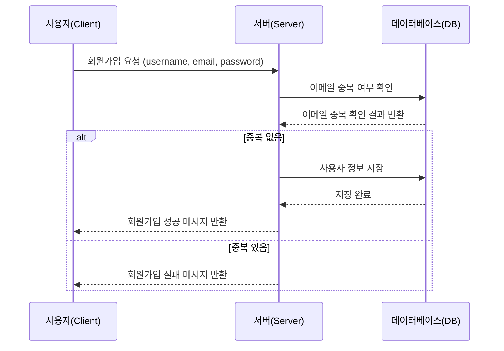

### 1.2. 로그인

사용자는 이메일과 비밀번호로 로그인 요청을 보낸다. 서버는 사용자의 이메일과 비밀번호가 일치하는지 확인 후, 일치하면 JWT 토큰을 발급한다.

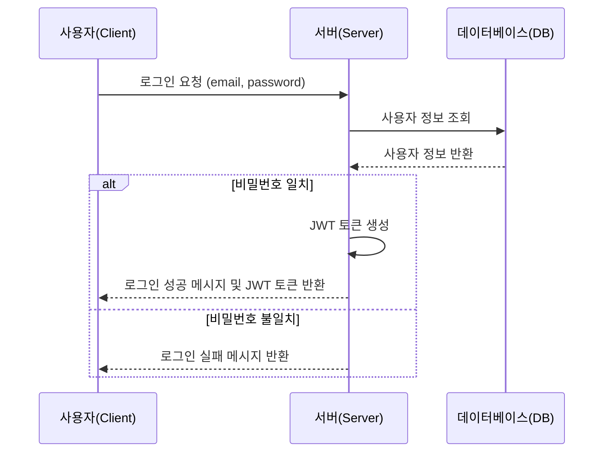

### 1.3. 회원 정보 조회

사용자는 자신의 정보를 검색할 수 있다. 서버는 인증된 사용자에 대해서만 정보를 반환한다.

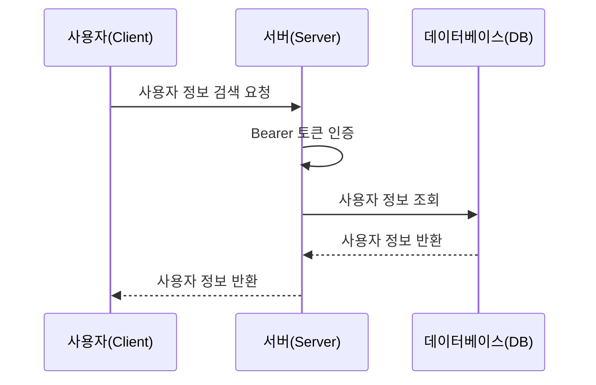

### 1.4. 회원 정보 수정

사용자는 자신의 정보를 수정할 수 있다. 서버는 인증된 사용자의 정보만 수정하며, 성공적으로 수정된 후 그 결과를 반환한다.

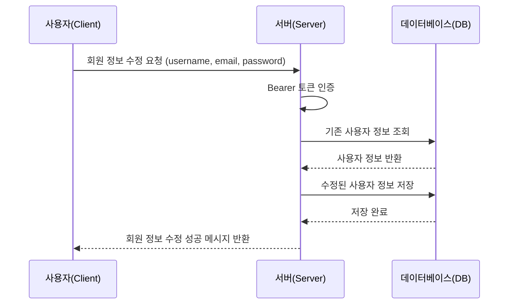

### 1.5. 비밀번호 변경

사용자는 기존 비밀번호와 새로운 비밀번호를 입력하여 비밀번호 변경을 요청한다. 서버는 기존 비밀번호를 확인한 후, 일치하면 비밀번호를 변경한다.

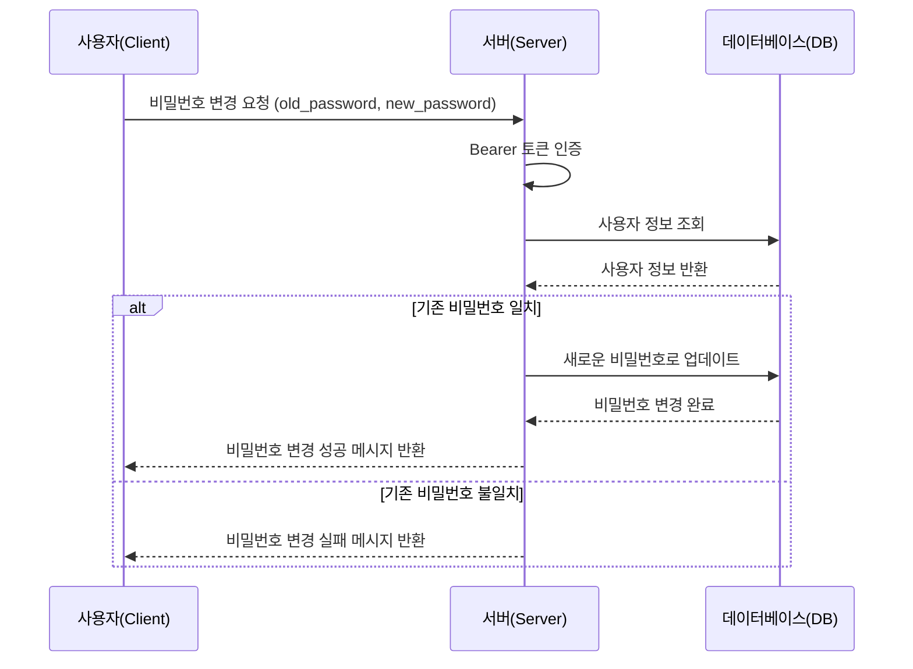

### 1.6. 회원 정보 삭제

사용자는 자신의 계정을 삭제할 수 있다. 서버는 인증된 사용자에 대해서만 삭제를 허용하며, 성공적으로 삭제된 후 결과를 반환한다.

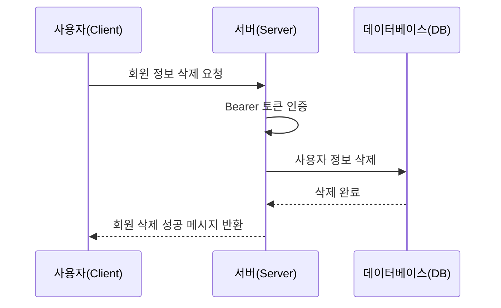

### 1.7. 로그아웃

사용자는 서버에 로그아웃 요청을 보낸다. 서버는 클라이언트 측에서 Bearer 토큰을 만료 처리한다.

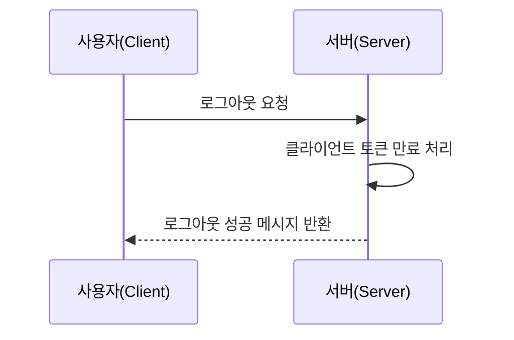

### 1.8 소셜 로그인

사용자가 카카오 로그인 요청을 하면, 서버는 카카오 서버에서 Authorization Code와 사용자 정보를 받아온다. 서버는 데이터베이스에서 사용자 정보를 확인하고, 새 사용자라면 저장한다. 로그인 성공 시, 서버는 JWT 토큰을 발급하여 클라이언트에 반환한다.

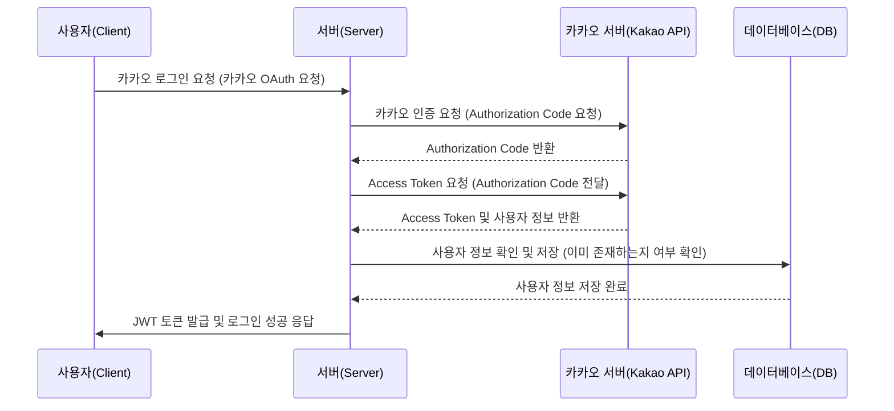

# 2. 그룹

### 2.1. 그룹 생성

사용자는 그룹 이름을 입력하여 새로운 그룹을 생성한다. 서버는 입력된 그룹명을 데이터베이스에 저장하고, 그룹 생성 성공 메시지를 반환한다.

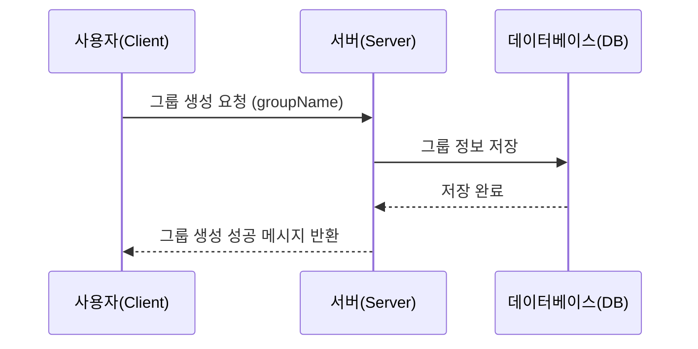

### 2.2. 그룹 수정

사용자는 그룹 이름을 수정할 수 있다. 서버는 기존 그룹 정보를 조회한 뒤, 수정된 그룹 이름을 데이터베이스에 저장하고 결과를 반환한다.

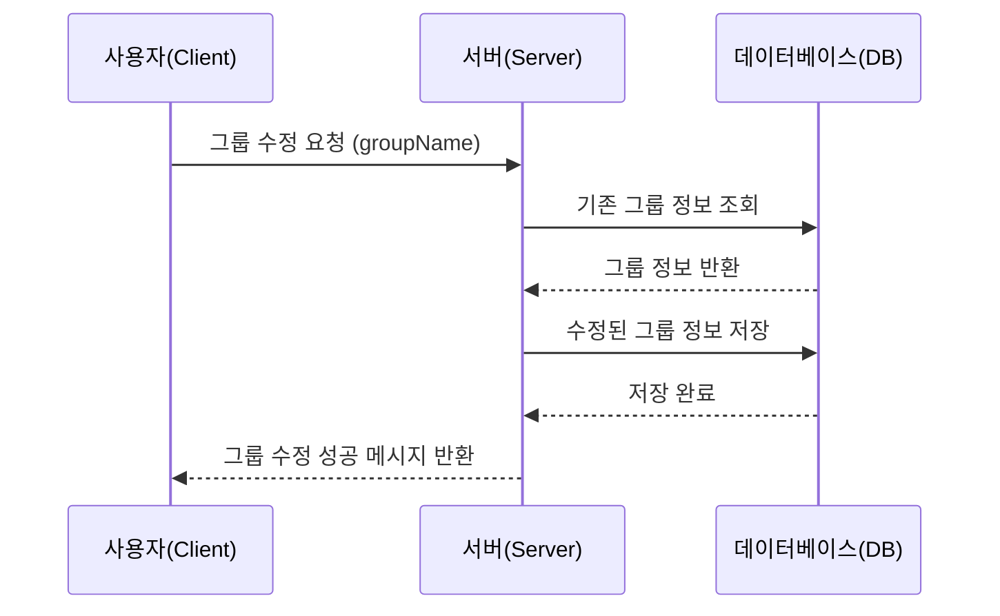

### 2.3. 그룹 삭제

사용자는 그룹을 삭제할 수 있다. 서버는 데이터베이스에서 해당 그룹 정보를 삭제하고, 성공 메시지를 반환한다.

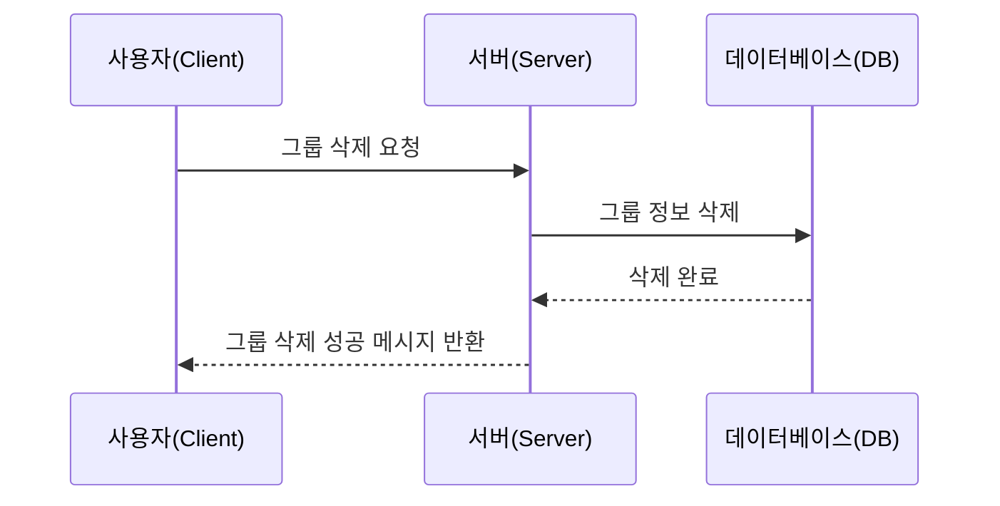

### 2.4. 사용자 그룹 목록 조회

사용자는 자신이 속한 그룹 목록을 조회할 수 있다. 서버는 인증된 사용자 정보를 기반으로 데이터베이스에서 그룹 목록을 조회하고 반환한다.

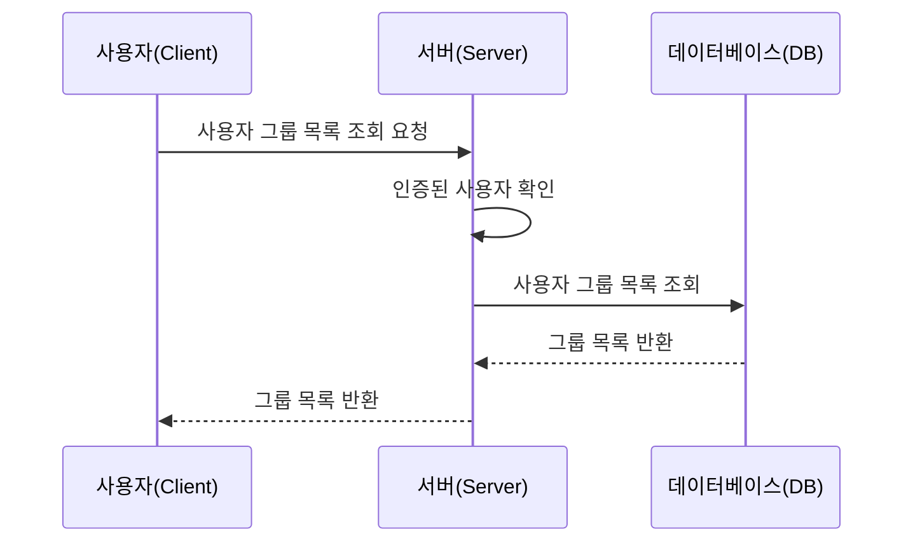

### 2.5. 그룹 멤버 추가

관리자는 그룹에 새로운 멤버를 추가할 수 있다. 서버는 해당 멤버의 정보를 데이터베이스에 추가하고, 성공 메시지를 반환한다.

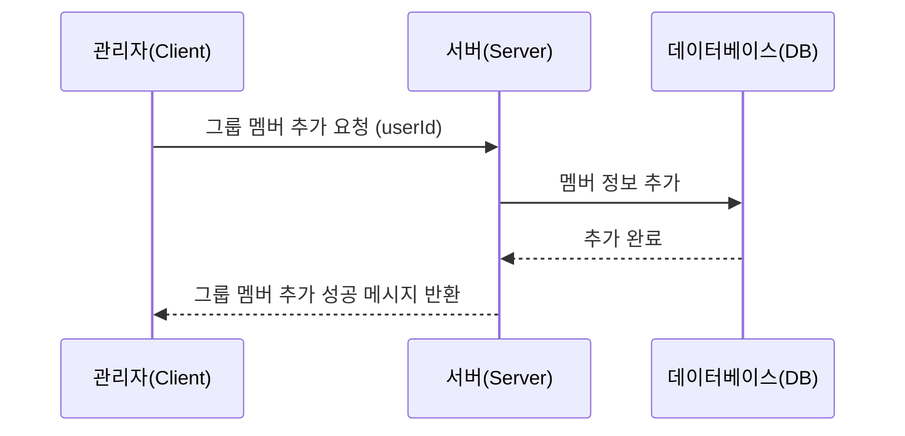

### 2.6. 그룹 멤버 삭제

관리자는 그룹에서 특정 멤버를 삭제할 수 있다. 서버는 해당 멤버의 정보를 데이터베이스에서 삭제하고, 결과를 반환한다.

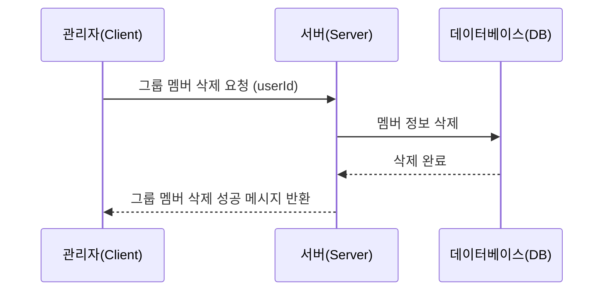

### 2.7. 그룹 멤버 목록 조회

사용자는 그룹의 멤버 목록을 조회할 수 있다. 서버는 해당 그룹의 멤버 정보를 데이터베이스에서 조회하고, 반환한다.


### 2.8 그룹 멤버 역할 변경

관리자는 특정 멤버의 그룹 내 역할을 변경할 수 있다. 서버는 해당 멤버의 역할을 데이터베이스에 업데이트하고, 성공 메시지를 반환한다.

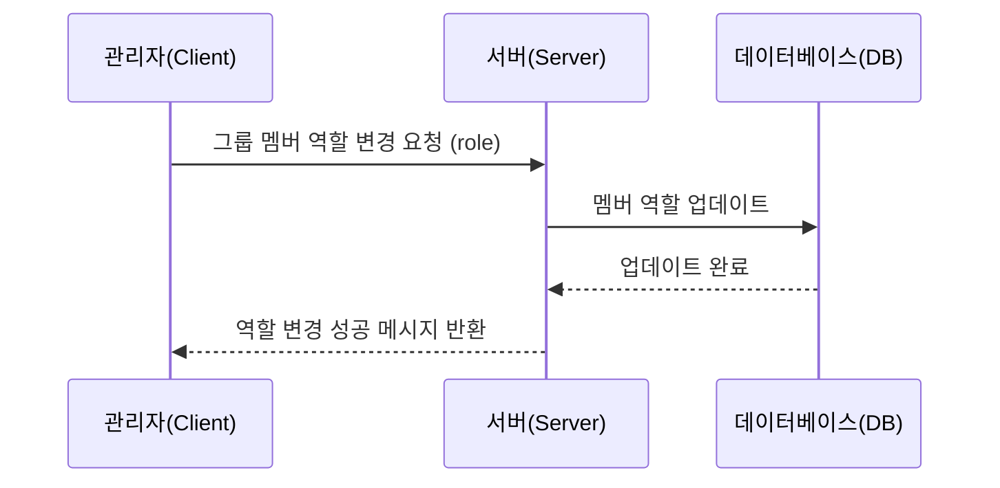

# 3. 일정 및 지도

### 3.1. 일정 생성 및 검색

사용자는 일정 이름, 설명, 시작일, 종료일, 도시 검색 기능을 통해 장소를 선택하고 일정을 생성할 수 있다. 서버는 입력된 정보를 데이터베이스에 저장하고, 일정 생성 성공 메시지를 반환한다.

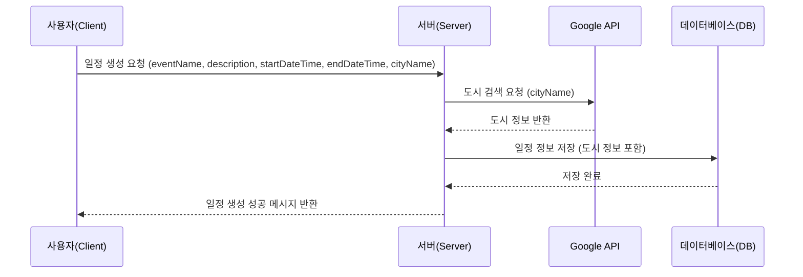

### 3.2. **일정표 및 WebSocket을 활용한 공동 관리**

사용자가 실시간으로 일정표를 관리할 수 있다. 여러 사용자가 동시에 일정을 수정할 수 있으며, WebSocket을 활용하여 모든 변경 사항이 실시간으로 반영된다.

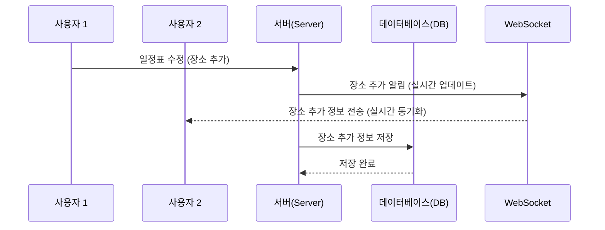

### 3.3. **장소 등록 및 지도 마커 경로 연결**

사용자는 일정을 생성하고 장소를 등록할 수 있으며, 각 장소는 시간 순서에 따라 지도에 마커로 표시된다. 또한, 각 날짜마다 장소를 경로로 연결하여 시각적으로 보여준다.

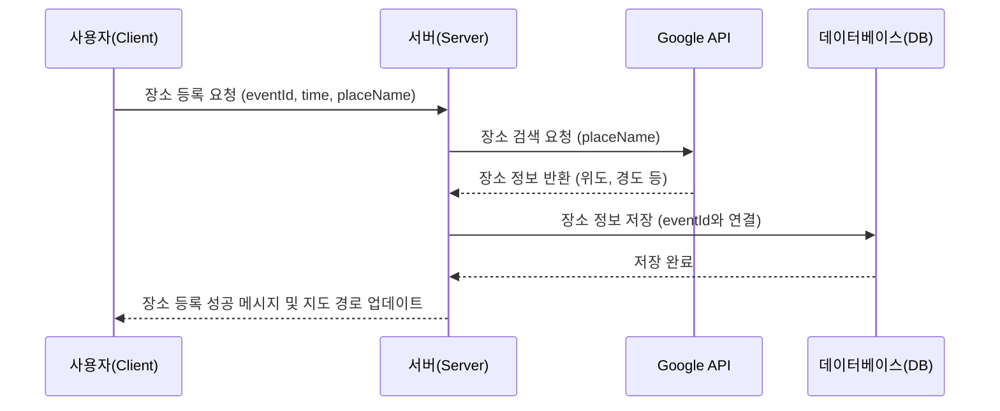

### 3.4. **공동 일정 관리 및 실시간 업데이트**

여러 사용자가 실시간으로 일정표를 관리하고 장소를 추가할 수 있다. WebSocket을 사용하여 모든 사용자가 실시간으로 변경 사항을 반영할 수 있다.

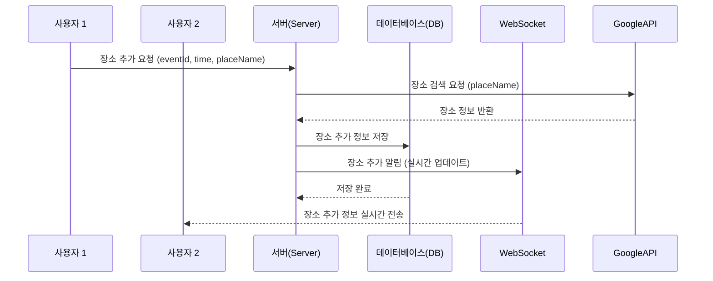

### 3.5. **지도 경로 연결 및 마커 표시**

각 날짜마다 등록된 장소들은 시간 순서대로 지도에 마커로 표시되며, 장소 간 경로가 연결된다.

```mermaid
sequenceDiagram
    participant Client as 사용자(Client)
    participant Server as 서버(Server)
    participant GoogleAPI as Google API
    participant MapAPI as 지도 API

    Client ->> Server: 일정 조회 요청 (eventId)
    Server ->> DB: 일정 및 장소 정보 조회
    DB -->> Server: 장소 정보 반환
    Server ->> GoogleAPI: 장소 좌표 요청 (위도, 경도)
    GoogleAPI -->> Server: 좌표 정보 반환
    Server ->> MapAPI: 마커 및 경로 생성 (장소 순서대로)
    MapAPI -->> Client: 마커 및 경로 표시된 지도 반환
```

# 4. 가계부 관리

### 4.1. 가계부 목록 조회

사용자가 특정 그룹의 가계부 목록을 요청하면, 서버는 데이터베이스에서 해당 그룹의 가계부 목록을 조회하여 반환한다.

```mermaid
sequenceDiagram
    participant Client as 사용자(Client)
    participant Server as 서버(Server)
    participant DB as 데이터베이스(DB)

    Client ->> Server: 가계부 목록 조회 요청 (groupId)
    Server ->> DB: 그룹 내 가계부 목록 조회 (groupId)
    DB -->> Server: 가계부 목록 반환
    Server -->> Client: 가계부 목록 반환
```

### 4.2. 지출 항목 추가/수정/삭제

사용자가 특정 그룹에 지출 항목을 추가, 수정, 삭제 요청 시, 서버는 해당 정보를 데이터베이스에 저장하거나 수정 또는 삭제를 처리한다.

```mermaid
sequenceDiagram
    participant Client as 사용자(Client)
    participant Server as 서버(Server)
    participant DB as 데이터베이스(DB)

    Client ->> Server: 지출 항목 추가/수정/삭제 요청 (groupId, expenseDetails)
    Server ->> DB: 지출 항목 추가/수정/삭제 처리
    DB -->> Server: 처리 완료
    Server -->> Client: 성공 메시지 반환
```

### 4.3. 영수증을 통한 지출 기록

사용자가 영수증을 업로드하면 서버는 Google Vision API를 사용해 영수증을 분석하고, OpenAI를 통해 날짜 포맷팅을 처리한 후, 데이터를 데이터베이스에 저장한다.

```mermaid
sequenceDiagram
    participant Client as 사용자(Client)
    participant Server as 서버(Server)
    participant GoogleVision as Google Vision API
    participant OpenAI as OpenAI
    participant DB as 데이터베이스(DB)

    Client ->> Server: 영수증 업로드 (이미지)
    Server ->> GoogleVision: 영수증 이미지 분석 요청
    GoogleVision -->> Server: 분석된 텍스트 반환
    Server ->> OpenAI: 날짜 포맷팅 요청
    OpenAI -->> Server: 날짜 포맷팅 결과 반환
    Server ->> DB: 영수증 정보 저장 (지출 항목 추가)
    DB -->> Server: 저장 완료
    Server -->> Client: 성공 메시지 반환
```

# 5. 환율

### 5.1. 환율 변환

사용자가 기준 국가, 변환 국가, 금액을 입력하면, 서버는 exchangerate API를 통해 최신 환율 정보를 가져와 변환된 금액을 반환한다.

```mermaid
sequenceDiagram
    participant Client as 사용자(Client)
    participant Server as 서버(Server)
    participant ExchangerateAPI as Exchangerate API

    Client ->> Server: 환율 변환 요청 (baseCountry, targetCountry, amount)
    Server ->> ExchangerateAPI: 최신 환율 정보 요청 (baseCountry, targetCountry)
    ExchangerateAPI -->> Server: 환율 정보 반환
    Server -->> Client: 변환된 금액 반환
```

### 5.2. 환율 정보 자동 갱신

매일 00시에 서버는 exchangerate API를 호출해 최신 환율 정보를 받아 데이터베이스에 갱신한다. 이 작업은 서버의 스케줄러에 의해 자동으로 실행된다.

```mermaid
sequenceDiagram
    participant Scheduler as 서버(스케줄러)
    participant Server as 서버(Server)
    participant ExchangerateAPI as Exchangerate API
    participant DB as 데이터베이스(DB)

    Scheduler ->> Server: 00시 자동 갱신 요청
    Server ->> ExchangerateAPI: 최신 환율 정보 요청
    ExchangerateAPI -->> Server: 환율 정보 반환
    Server ->> DB: 환율 정보 갱신
    DB -->> Server: 갱신 완료
```

# 6. 챗봇

### 6.1. 챗봇 대화 기능

사용자가 메시지를 보내면, 서버는 OpenAI API에 요청을 보내 답변을 받는다. 서버는 대화 내역을 캐시나 메모리 상에 저장하며, 최대 5개의 메시지를 유지한다. 이후 대화가 이어질 때 해당 대화 내역을 활용할 수 있다. 사용자가 페이지를 벗어나면, 서버는 캐시된 대화 기록을 삭제한다.

```mermaid
sequenceDiagram
    participant Client as 사용자(Client)
    participant Server as 서버(Server)
    participant OpenAI as OpenAI API
    participant Cache as 서버(메시지 캐시)

    Client ->> Server: 챗봇 대화 요청 (사용자 메시지)
    Server ->> Cache: 메시지 저장 (최대 5개 유지)
    Server ->> OpenAI: 답변 요청 (사용자 메시지 전달)
    OpenAI -->> Server: 답변 반환
    Server ->> Cache: 답변 저장 (최대 5개 유지)
    Server -->> Client: 답변 반환

    alt 페이지를 벗어남
        Client ->> Server: 페이지 벗어남 이벤트
        Server ->> Cache: 메시지 캐시 삭제
    end
```

# 7. 날씨

### 7.1. 날씨 검색 기능

사용자가 특정 날짜와 장소를 입력하여 날씨 정보를 검색한다. 서버는 장소에 대한 정보를 기반으로 위치 좌표를 요청한다. 서버는 OpenWeather의 Geocoding API를 사용하여 입력된 장소의 위도와 경도를 가져온다. 서버는 받은 좌표와 날짜 정보를 바탕으로 OpenWeather의 5 Day/3 Hour Forecast API를 호출하여 해당 날짜의 날씨 정보를 요청한다.

```mermaid
sequenceDiagram
    participant Client as 사용자(Client)
    participant Server as 서버(Server)
    participant GeocodingAPI as Geocoding API (OpenWeather)
    participant ForecastAPI as 5 Day/3 Hour Forecast API
    participant DB as 데이터베이스(DB)

    Client ->> Server: 날씨 검색 요청 (날짜, 장소)
    Server ->> GeocodingAPI: 장소에 대한 좌표 요청 (장소명)
    GeocodingAPI -->> Server: 좌표 정보 반환 (위도, 경도)
    Server ->> ForecastAPI: 좌표 및 날짜에 따른 날씨 정보 요청 (위도, 경도)
    ForecastAPI -->> Server: 날씨 정보 반환
    Server ->> DB: 날씨 정보 저장 (선택적)
    Server -->> Client: 날씨 정보 반환
```

</details>

<br>

### Figma 화면 설계
<a href="https://www.figma.com/design/zirndKAJsew3kCY0CvopmQ/Untitled?node-id=0-1&t=77nvrr545N2jRpjr-1">
  Figma - Voya9e 화면 설계
</a>

<br><br>

### ERD


<br>

## 4. 역할 분담

### 🍏 윤건우
- **회원 관리**
  - 회원 가입
  - 로그인
  - 회원 정보 수정
  - 회원 탈퇴
  - OAuth 2.0 카카오 소셜 로그인
- **인증/인가**
  - JWT, 쿠키를 활용한 AccessToken 관리
  - Redis를 활용한 RefreshToken 관리
- **날씨**
  - OpenWeather API(Geocoding, 5 Day/ 3 Hour Forecast)를 활용한 날씨 검색

<br>

### 🍋 김가현
- **가계부 관리**
    - 그룹 별로 가계부 삽입, 수정, 삭제, 읽기
    - Google Vision API를 활용한 영수증 OCR
    - open ai를 활용한 영수증 날짜 포맷팅
    - OCR과 날짜 포맷팅을 이용해 영수증 이미지로 효율적으로 가계부 삽입 가능
- **환율**
    - exchangerate API를 활용한 환율 변환 기능
    - 매일 00시에 자동으로 API 호출해서 환율 정보를 갱신하도록 함
- **챗봇**
    - open ai를 활용한 챗봇 기능
    - 최대 5개의 메시지를 저장해 대화가 이어지도록 함

<br>

### 🍒 이현섭
- **그룹**
    - 그룹 생성
    - 그룹 삭제
    - 그룹 이름 변경
    - 그룹에 멤버 초대
        - WEBSOCKET을 활용한 비동기 통신 초대 메세지 구현
        - 초대 수락/거절 여부 알림 구현

<br>

### 🍊 정지수
- **일정 추가하기**
    - 일정 추가를 위한 날짜 검색, 도시 검색 기능
- 일정표
    - WebSoekct을 활용한 공동 일정 관리 (엑셀형식)
    - 일정표에 장소 추가하기
    - google api
        - 도시 검색, 나라별 도시 검색, 장소 검
        - 상세보기
        - 지도
    - 지도에 마커 경로 이어주기
        - 각 날짜마다 장소들을 시간 순서대로 마커 경로 이어주기
